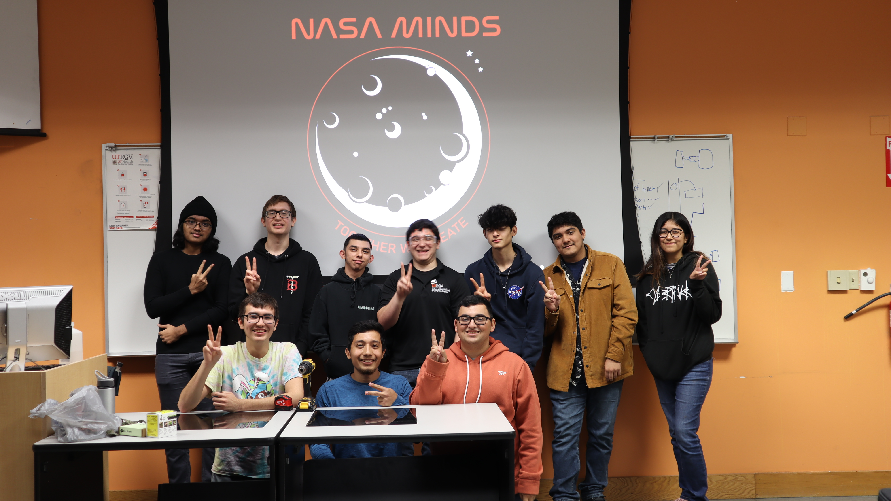
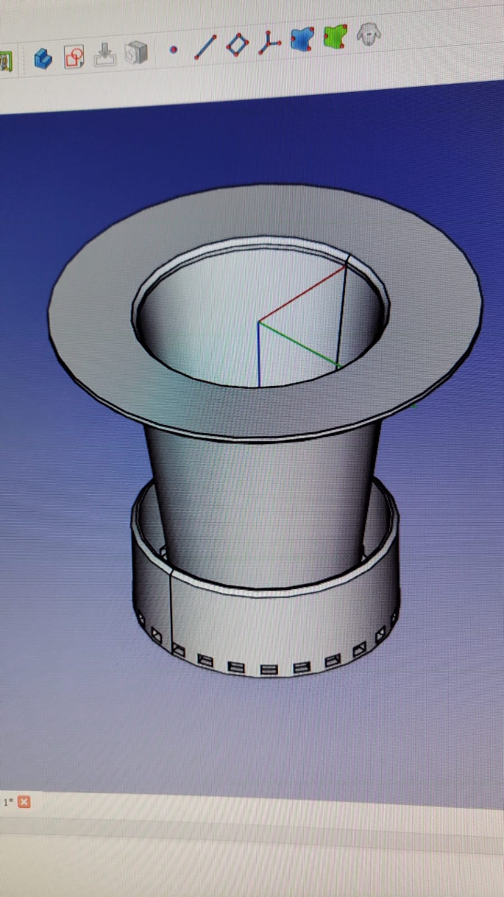

# NasaMinds - UTRGV

### Welcome to `NasaMinds`.

We design, innovate, and create intricate solutions to aid in outer space travel. Join us and see for yourself on how our team is able to accomplish monumental tasks tailored to prepare our future for spacial colonization.

## Our Creation
**Hydraponic System**

> "This project bussin' frfr" -Albert Einstein

Plants are critical for our survival, for they provide oxygen and food - both scarce beyond Earth. However, farming them using traditional methods don't hold up in space. Therefore, we created the **Hydraponic System**. Our solution automatically farms and maintains crops without using dirt. The clever robotic mechanism feeds the crops with water and a perfect blend of nutrients, yet little maintenence is on the system is needed.